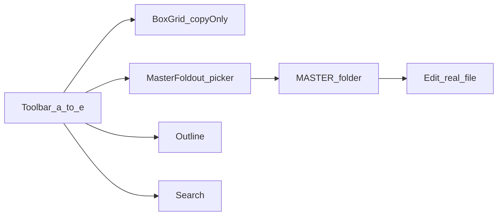

# KindasMD v2 roadmap

## Master Rule 1 (always apply)

> "Understand the whole, then change the smallest correct thing. Before acting, you must be able to describe the system's purpose, constraints, and relationships completely. If an assumption could break the result, you are not ready. When acting, make the smallest change that reaches the root cause. Every element must earn its place — proliferating rules signals a failure to understand the problem."

## HARD RULE — phase-end handoff (non-negotiable)

At **every** phase **HARD STOP**, give the user **one short paste**: **Finished** + **What's next** (the fence below). Build steps, verify script, cold-start read order, and invariants are **already** in `CONTINUATION.md`, `README.md`, and this file — **do not** duplicate them in chat.

The same **What's next** fence is repeated **at the end of each phase** so it stays copyable.

### What's next — mandatory paste for user

```text
## KindasMD — what's next (paste for the user)

**Finished:** [one line — what closed this session / phase]

**What's next:** [short — only the real next work, e.g. next roadmap phase goal or the next bug; no build tutorial]

**Note:** [optional — blocker, risk, or decision]

---
Already in repo (do not repeat): @KindasMD/CONTINUATION.md · @KindasMD/README.md · @KindasMD/kindasmd_v2_roadmap.md
```

---

**Canonical plan** for what we are building: phased work, risk notes, HARD STOPs, and a short **What's next** handoff paste. **Read this before feature work** so agents know phases, constraints, and how to continue.

**Source of truth:** this file at `KindasMD/kindasmd_v2_roadmap.md` in the repo. Cursor may also store a mirror at `~/.cursor/plans/kindasmd_v2_roadmap_*.plan.md`; if they diverge, **treat this repo file as authoritative** unless you deliberately sync both.

---

## Authoritative inputs (read first every session)

**Dock-only verification:** The user **only** launches **`KindasMD.app`**. Editor work ships in **`KindasMDEditor.app`**, but **`system/kindasmd`** must resolve the build you intend (copy to **`~/MBP-Mods/KindasMD/KindasMDEditor.app`**). See **[README.md](README.md)** — *How you run it*.

| Document                                                                             | Role                                                                                                                                                         |
| ------------------------------------------------------------------------------------ | ------------------------------------------------------------------------------------------------------------------------------------------------------------ |
| [KindasMD_Blueprint.md](../KindasMD_Blueprint.md)                                       | UI map: (a) box grid, (b) Master + picker, (c) link optional, (d) outline, (e) search; `MASTER` lives under `~/TextMD/MASTER`.                               |
| [ClearlyMD/README.md](../ClearlyMD/README.md)                                           | Two-app model, **CFBundleExecutable** = `Clearly`, Release zip from KindasOS CI — **editor source is not in this repo** (only `.app` + `system/` scripts). |
| [ClearlyMD/system/ClearlyMD-SetupGuide.md](../ClearlyMD/system/ClearlyMD-SetupGuide.md) | Mach-O Dock launcher pattern, `lsregister`, `duti`, env vars, icon copy chain.                                                                               |


**Tooling decision:** Build the editor as a **native Xcode Swift/AppKit (or SwiftUI) project** targeting the same Clearly fork workflow as ClearlyMD. Agents use Xcode for compile/sign; you do not need to drive the IDE manually beyond occasional signing prompts.

---

## Naming (per your spec; inverted vs Clearly)


| App                                               | Role                            | Suggested bundle id        | Notes                                                                                                               |
| ------------------------------------------------- | ------------------------------- | -------------------------- | ------------------------------------------------------------------------------------------------------------------- |
| **KindasMD.app**                                | Dock / “new note in `~/TextMD`” | e.g. `com.kindasmd.dock`   | **Display name `KindasMD`** — matches “the app used in the dock.”                                                   |
| **KindasMDEditor.app** (or `KindasMD — Editor`) | Clearly-based editor            | e.g. `com.kindasmd.editor` | **Logical suffix** so Finder/LS don’t confuse two `KindasMD` bundles; menu bar can still say “KindasMD” if desired. |


Launcher script + env: mirror `CLEARLYMD_APP` → `KINDASMD_EDITOR_APP` (or similar) so paths stay overridable like [ClearlyMD/system/clearlyedit](../ClearlyMD/system/clearlyedit).

---

## Where code will live (recommended layout)

Create a **new top-level folder** (do not mutate [ClearlyMD/](../ClearlyMD/) in place):

- `MBP-Mods/KindasMD/` — `KindasMD.app`, `KindasMDEditor.app`, `system/` (scripts, `launcher.c`, `install-*.sh`, `setup-*.sh`, `verify-*.sh`)
- `MBP-Mods/KindasMD/src/` or separate git repo — **Xcode project** for the editor (Clearly fork). *This repo currently has **no `.xcodeproj`** in older layouts; the Swift sources live under **`KindasMD/src/editor/`** (xcodegen).*

**First technical prerequisite:** Locate and clone the **Clearly fork source** used to produce `Clearly-Debug-unsigned.zip` (documented as [kindashub/KindasOS](https://github.com/kindashub/KindasOS) CI). Treat that tree as the **only** place split-view and core editing behavior are modified—**minimal diffs** to preserve “don’t touch split screen.”

---

## Feature mapping from [KindasMD_Blueprint.md](../KindasMD_Blueprint.md)




- **(a)** Replace “Blueprint types box chars into a field” with a **compact grid of small buttons**; tap **copies to clipboard** (no insertion). Optional **“Edit squares”** mode to assign characters (persistence: UserDefaults or JSON beside app support).
- **(b)+(g)+(h)** New **fold-down** like legacy Blueprint area, plus **picker** listing `*.md` in **`~/TextMD/MASTER/`**. Selecting a file **loads that file into the editable pane**; saves go to **disk** (true file URL, not a buffer-only view). Create `MASTER` on first run if missing.
- **(c)** Defer or omit if built-in edit/preview link is sufficient—**confirm after baseline** Clearly behavior.
- **(d)+(e)** **Outline** and **Search** are separate slices (see effort below).

---

## Effort, risk, and session sizing


| Chunk                                                  | Effort | Risk                | Why                                                                 |
| ------------------------------------------------------ | ------ | ------------------- | ------------------------------------------------------------------- |
| A — Toolchain + empty fork build                       | S      | Low                 | Proves Xcode, signing, archive.                                     |
| B — Rebrand + Menlo only                               | S      | Low                 | Info.plist, fonts, no logic.                                        |
| C — Split screen untouched + regression checklist      | S      | **High** if touched | **Explicit “no edits in split-view code paths”** rule; diff review. |
| D — Dock app + `system/` scripts                       | M      | Low                 | Proven pattern from ClearlyMD.                                      |
| E — Toolbar chrome: smooth dropdown **like** Blueprint | M      | Med                 | Match UX; may be AppKit custom or SwiftUI overlay.                  |
| F — Box grid + clipboard + edit layout                 | M      | Med                 | Many small controls; Auto Layout.                                   |
| G — MASTER picker + bound file editor                  | L      | **High**            | Security-scoped bookmarks, reload, external changes, errors.        |
| H — Outline                                            | L      | Med–High            | Needs structure (Markdown headings or NSTextList).                  |
| I — Search                                             | M      | Med                 | NSTextView find panel vs custom.                                    |


---

## Phases with HARD STOP and handoff

After each phase: **stop**, run manual checks, then give the user the **What's next** paste (below each phase — fill **Finished** / **What's next**). Then hand off to a **new agent** with that paste.

### Phase 0 — Prerequisites and repo skeleton

**Do:** Xcode + CLT; decide editor repo path; add `KindasMD/` with README pointer to blueprint; stub scripts naming `KINDASMD_*`; **no feature code**.

**Verify:** Folder layout exists; no Clearly fork changes yet.

**HARD STOP.** Give the user the short **What's next** paste below — fill **Finished** and **What's next** only (template matches the fence at the top of this doc).

```text
## KindasMD — what's next (paste for the user)

**Finished:** [one line — what closed this session / phase]

**What's next:** [short — only the real next work, e.g. next roadmap phase goal or the next bug; no build tutorial]

**Note:** [optional — blocker, risk, or decision]

---
Already in repo (do not repeat): @KindasMD/CONTINUATION.md · @KindasMD/README.md · @KindasMD/kindasmd_v2_roadmap.md
```


---

### Phase 1 — Import Clearly source and first green build

**Do:** Clone/open Clearly from KindasOS; create Xcode project; produce `KindasMDEditor.app` that launches and opens `.md`; **do not** add KindasMD-specific toolbar features yet.

**Verify:** App runs from Xcode and from `/Applications` or `MBP-Mods/KindasMD/`; open/save file.

**Risk:** Upstream project structure drift—budget extra time if the fork differs from docs.

**HARD STOP.** Give the user the short **What's next** paste below — fill **Finished** and **What's next** only (template matches the fence at the top of this doc).

```text
## KindasMD — what's next (paste for the user)

**Finished:** [one line — what closed this session / phase]

**What's next:** [short — only the real next work, e.g. next roadmap phase goal or the next bug; no build tutorial]

**Note:** [optional — blocker, risk, or decision]

---
Already in repo (do not repeat): @KindasMD/CONTINUATION.md · @KindasMD/README.md · @KindasMD/kindasmd_v2_roadmap.md
```


---

### Phase 2 — Baseline product rules: Menlo + split screen freeze

**Do:** Set **Menlo** as editor (and preview if applicable per design); **document files/paths that implement split view** and add a short **“no-edit without review”** list in project notes (not necessarily user-facing docs unless you want).

**Verify:** Side-by-side behavior matches **fresh Clearly** baseline; no regressions in resize/sync.

**HARD STOP.** Give the user the short **What's next** paste below — fill **Finished** and **What's next** only (template matches the fence at the top of this doc).

```text
## KindasMD — what's next (paste for the user)

**Finished:** [one line — what closed this session / phase]

**What's next:** [short — only the real next work, e.g. next roadmap phase goal or the next bug; no build tutorial]

**Note:** [optional — blocker, risk, or decision]

---
Already in repo (do not repeat): @KindasMD/CONTINUATION.md · @KindasMD/README.md · @KindasMD/kindasmd_v2_roadmap.md
```


---

### Phase 3 — Dock launcher parity

**Do:** Port [ClearlyMD/system/build-clearlyedit-app.sh](../ClearlyMD/system/build-clearlyedit-app.sh) pattern: Mach-O launcher → bash script; **KindasMD.app** display name; icon pipeline (reuse/adapt ClearlyEdit’s **copy from editor `.icns`** approach); `setup-kindasmd.sh` + `install-kindasmd-editor.sh` (download zip if you keep CI) or local build copy.

**Verify:** Click Dock app → new `TX-…` file in `~/TextMD` → opens in editor; `verify-kindasmd-app.sh` analog passes.

**HARD STOP.** Give the user the short **What's next** paste below — fill **Finished** and **What's next** only (template matches the fence at the top of this doc).

```text
## KindasMD — what's next (paste for the user)

**Finished:** [one line — what closed this session / phase]

**What's next:** [short — only the real next work, e.g. next roadmap phase goal or the next bug; no build tutorial]

**Note:** [optional — blocker, risk, or decision]

---
Already in repo (do not repeat): @KindasMD/CONTINUATION.md · @KindasMD/README.md · @KindasMD/kindasmd_v2_roadmap.md
```


---

### Phase 4 — Toolbar: (a) box grid + (b) Master foldout shell

**Do:** Implement **dropdown/collapse UX** matching legacy Blueprint **feel** (animation, button styling) but **new behavior**: (a) grid only; (b) foldout with placeholder text until Phase 5–6.

**Verify:** UI only; no file I/O for MASTER yet optional.

**HARD STOP.** Give the user the short **What's next** paste below — fill **Finished** and **What's next** only (template matches the fence at the top of this doc).

```text
## KindasMD — what's next (paste for the user)

**Finished:** [one line — what closed this session / phase]

**What's next:** [short — only the real next work, e.g. next roadmap phase goal or the next bug; no build tutorial]

**Note:** [optional — blocker, risk, or decision]

---
Already in repo (do not repeat): @KindasMD/CONTINUATION.md · @KindasMD/README.md · @KindasMD/kindasmd_v2_roadmap.md
```


---

### Phase 5 — (a) Full: clipboard squares + “Edit squares” persistence

**Do:** Dense grid, copy on click, edit mode, persistence.

**Verify:** Relaunch retains layout; clipboard matches click.

**HARD STOP.** Give the user the short **What's next** paste below — fill **Finished** and **What's next** only (template matches the fence at the top of this doc).

```text
## KindasMD — what's next (paste for the user)

**Finished:** [one line — what closed this session / phase]

**What's next:** [short — only the real next work, e.g. next roadmap phase goal or the next bug; no build tutorial]

**Note:** [optional — blocker, risk, or decision]

---
Already in repo (do not repeat): @KindasMD/CONTINUATION.md · @KindasMD/README.md · @KindasMD/kindasmd_v2_roadmap.md
```


---

### Phase 6 — (b)+(g)+(h): MASTER folder integration

**Do:** Ensure `~/TextMD/MASTER`; enumerate `.md`; picker; load/save **real files**; handle missing folder and empty list.

**Verify:** Edit file on disk; confirm in Terminal/`cat`; external edit reload policy (at minimum: reopen or simple “reload” if cheap).

**HARD STOP.** Give the user the short **What's next** paste below — fill **Finished** and **What's next** only (template matches the fence at the top of this doc).

```text
## KindasMD — what's next (paste for the user)

**Finished:** [one line — what closed this session / phase]

**What's next:** [short — only the real next work, e.g. next roadmap phase goal or the next bug; no build tutorial]

**Note:** [optional — blocker, risk, or decision]

---
Already in repo (do not repeat): @KindasMD/CONTINUATION.md · @KindasMD/README.md · @KindasMD/kindasmd_v2_roadmap.md
```


---

### Phase 7 — (d) Outline

**Do:** Heading-based outline (typical for Markdown); jump-to-line.

**Verify:** Large doc; outline accuracy.

**HARD STOP.** Give the user the short **What's next** paste below — fill **Finished** and **What's next** only (template matches the fence at the top of this doc).

```text
## KindasMD — what's next (paste for the user)

**Finished:** [one line — what closed this session / phase]

**What's next:** [short — only the real next work, e.g. next roadmap phase goal or the next bug; no build tutorial]

**Note:** [optional — blocker, risk, or decision]

---
Already in repo (do not repeat): @KindasMD/CONTINUATION.md · @KindasMD/README.md · @KindasMD/kindasmd_v2_roadmap.md
```


---

### Phase 8 — (e) Search

**Do:** Integrate find (panel or in-toolbar) consistent with editor.

**Verify:** Case sensitivity and wrap as agreed.

**HARD STOP.** Give the user the short **What's next** paste below — fill **Finished** and **What's next** only (template matches the fence at the top of this doc).

```text
## KindasMD — what's next (paste for the user)

**Finished:** [one line — what closed this session / phase]

**What's next:** [short — only the real next work, e.g. next roadmap phase goal or the next bug; no build tutorial]

**Note:** [optional — blocker, risk, or decision]

---
Already in repo (do not repeat): @KindasMD/CONTINUATION.md · @KindasMD/README.md · @KindasMD/kindasmd_v2_roadmap.md
```


---

## What not to do (failure modes)

- **Don’t** copy forward ad-hoc patches from old ClearlyMD builds without tracing them to source—use a **fresh Clearly zip + clean git history** for KindasMD.
- **Don’t** mix TiddlyWiki / `tw-tama` rules from your global user rules into this native app plan unless you explicitly scope a bridge—they are unrelated stacks.
- **Don’t** implement (d)(e) before MASTER and box grid are stable—reduces debugging surface.

---

## Suggested agent allocation


| Session | Focus                                                  |
| ------- | ------------------------------------------------------ |
| 1       | Phases 0–1 (skeleton + first build)                    |
| 2       | Phase 2 + smoke tests (split freeze)                   |
| 3       | Phase 3 (scripts + Dock)                             |
| 4       | Phases 4–5 (toolbar + box grid) — **largest UI chunk** |
| 5       | Phase 6 (MASTER) — **highest integration risk**        |
| 6       | Phases 7–8 (outline + search)                          |


Adjust if Phase 1 reveals upstream friction.
